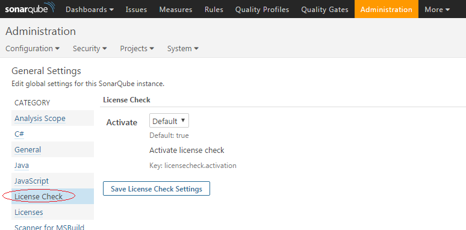
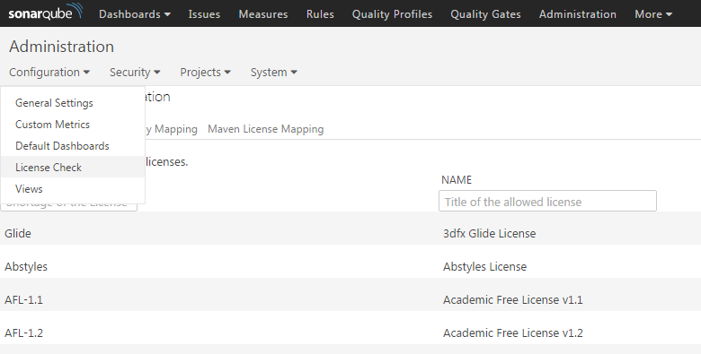

Sonarqube Licensecheck Plugin
===================

This [SonarQube](http://www.sonarqube.org/) plugin ensures that projects in an organization adhere to a set of standard libraries and versions. This enables the governance of the used libraries and licences.

## License

This software is licensed under the Apache Software License, Version 2.0, http://www.apache.org/licenses/LICENSE-2.0.txt

## Compatibility

### SonarQube
The plugin is compatible with SonarQube >= 5.3 and <= 5.6.

## Installation

Put the pre-built jar-file (from release downloads) in the directory `$SONARQUBE_HOME/extensions/plugins` and restart the server to install the plugin.

## Execution

When a project is analyzed using the `mvn sonar:sonar` in command line the extension is started automatically.

## Configuration

After booting the SonarQube Server with the Licensecheck Plugin two new options can be found in the tab <b>Administrasion</b>.

* Within the general settings the plugin can be manually enabled or disabled. By default it is enabled. 
* All other configuration is under Licensecheck specific settings (Configuration > License Check) 
* If you want to create issues on license violation or unknown licences, enabled the rules "License is not allowed" and "Dependency has unknown license"

## Features

### Analysis

The plugin scans for dependencies defined in your project including all transitive dependencies. 

Currently supported formats are:
* Maven POM files - all dependencies with scope "compile" and "runtime" are checked
* NPM package.json files - all dependencies (except "devDependencies") are checked

### Dashboard widgets

The plugin contains two dashboard widgets - the first ("License data") showing a list of dependencies with version and
license, the second ("Used Licenses") a list of all used licences. Each widget shows the status of the license 
(allowed, not allowed, not found).

Example for "License data":
<table>
  <tr><th>Status</th><th>Name</th><th>Version</th><th>Status</th></tr>
  <tr><td>Allowed</td><td>org.springframework.boot:spring-boot</td><td>1.4.0.RELEASE</td><td>Apache-2.0</td></tr>
  <tr><td>Allowed</td><td>core-js</td><td>2.4.0</td><td>MIT</td></tr>
  <tr><td>Not Allowed</td><td>dk.brics.automaton:automaton</td><td>1.11-8</td><td>BSD-3-Clause</td></tr>
  <tr><td>Not Found</td><td>saxon:saxon</td><td>9.1.0.8j</td><td></td></tr>
</table>

Example for "Used Licenses":
<table>
  <tr><th>Identifier</th><th>Name</th><th>Status</th></tr>
  <tr><td>Apache-2.0</td><td>Apache License 2.0</td><td>Allowed</td></tr>
  <tr><td>MIT</td><td>MIT License</td><td>Allowed</td></tr>
  <tr><td>BSD-3-Clause</td><td>BSD 3-clause New or Revised License</td><td>Not Allowed</td></tr>
</table>
